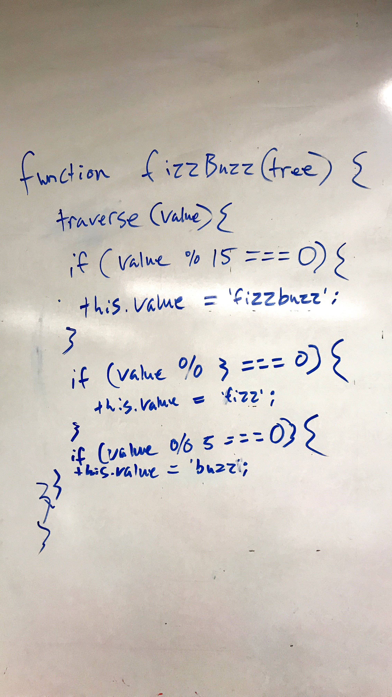

# Challenge Summary
Conduct “FizzBuzz” on a tree while traversing through it. Change the values of each of the nodes dependent on the current node’s value.

## Challenge Description
Write a function called FizzBuzzTree which takes a tree as an argument.
* Without utilizing any of the built-in methods available to your language, determine whether or not the value of each node is divisible by 3, 5 or both, and change the value of each of the nodes:
  * If the value is divisible by 3, replace the value with “Fizz”
  * If the value is divisible by 5, replace the value with “Buzz”
  * If the value is divisible by 3 and 5, replace the value with “FizzBuzz”
  * Return the tree with its new values.

## Approach & Efficiency
The logic for this function is not terribly complex. All one has to do it traverse through a Binary Tree, and for each value that is reached, determine whether it is divisible by 3, 5, or both, and then change the value to fizz, buzz, or fizzbuzz respectively. 

## Solution

