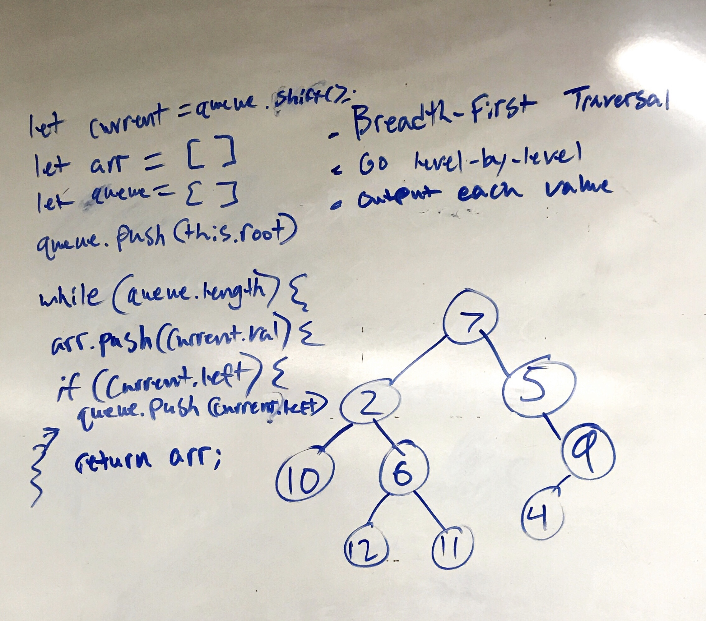

# Challenge Summary
Breadth-first Traversal.

## Challenge Description
Write a breadth first traversal method which takes a Binary Tree as its unique input. Without utilizing any of the built-in methods available to your language, traverse the input tree using a Breadth-first approach; print every visited node’s value.

## Approach & Efficiency
In order to traverse a Binary Tree Breadth-First, you need to go level-by-level. Which is essentially a queue. To implement this efficiently, I pushed values into an array on a FIFO basis. 

## Solution
