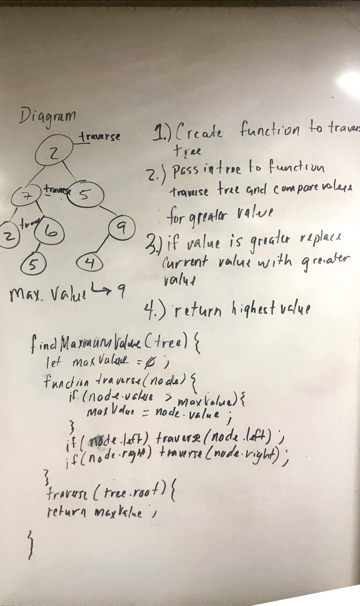

# Challenge Summary
Find the Maximum Value in a Binary Tree.

## Challenge Description
Write a function called findMaximumValue(). Without utilizing any of the built-in methods available to your language, return the maximum value stored in the tree. You can assume that the values stored in the Binary Tree will be numeric.

## Approach & Efficiency
For this challenge, I have one storage container that sorts through the right side of the Binary Tree, and another that traverses through the left side. Both of these replace their value with the current value if it is higher than what was previously stored. After this is completed, the two storage values are then compared, and whichever is higher gets returned.

## Solution
